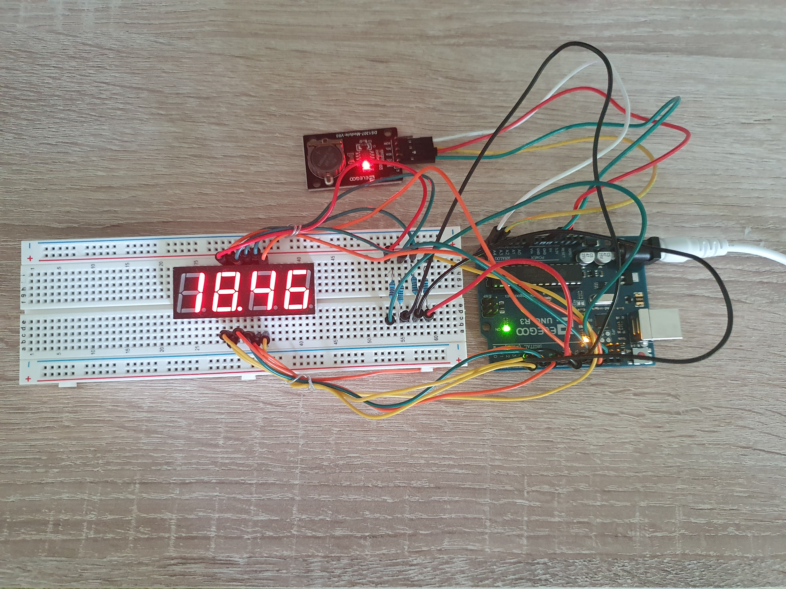
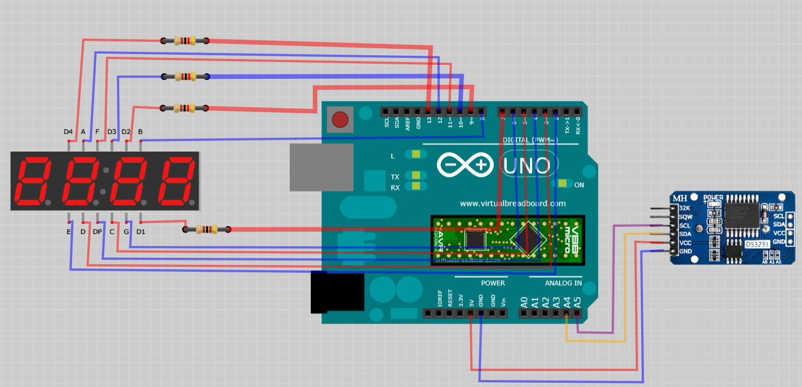

# Aduino Red Clock

Implementation of clocks using an Arduino, a real time module DS3231 and a 4-digit 7-segment display.

### Equipment
* Elegoo UNO R3 - x1
* 4-digit 7-segment Display - x1
* Real time clock module DS3231 - x1
* Resistors 100 Ohm - x4
* 830 Tie-Points Breadboard - x1
* Wires - x20
* 9V/1A DC Power supply (DC-005 male plug) - x1
* USB Cable - x1

### Circuit Diagram

### Tools
* Arduino Studio 1.8.14

### Optional
* Virtual Breadboard 1.5.0 - to open and modify the circuit diagram

### Flash
* Connect the microcontroller via USB
* Open src/arduino-red-clock/arduino-red-clock.ino in Arduino Studio
* Go to Sketch -> Include Library -> Use ZIP Library...
* Select src/DS3231.zip library
* Compile and flash the sketch
